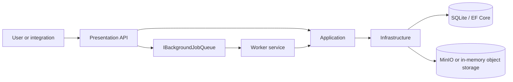
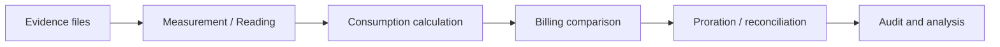
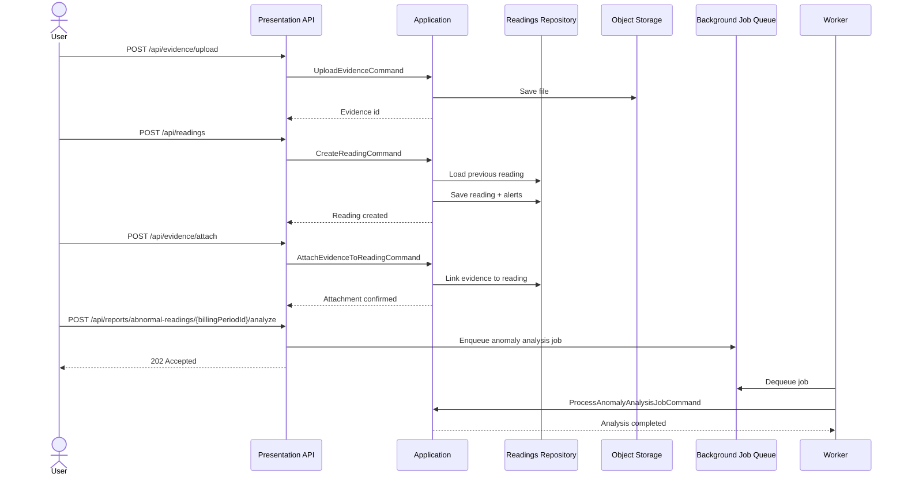
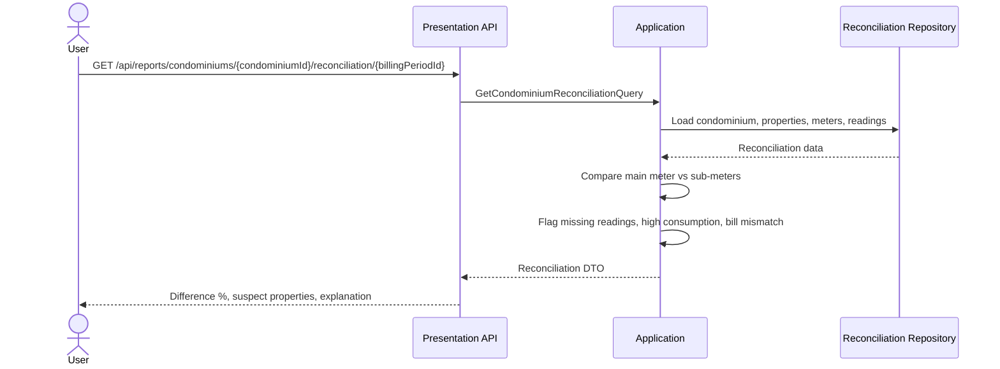
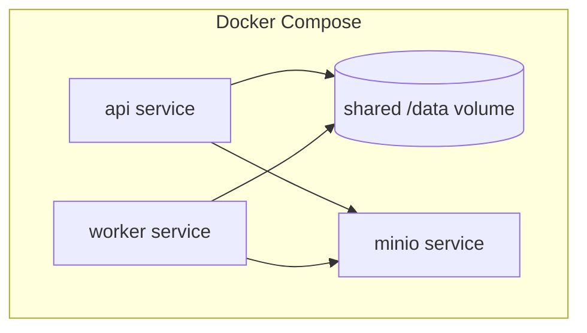

# UtilityMeter Architecture

## Overview

UtilityMeter follows the repository's four-project structure:

- **Presentation** receives HTTP requests and exposes Swagger/OpenAPI.
- **Application** contains domain logic, MediatR commands and queries, validators, and DTO mappings.
- **Infrastructure** provides SQLite/EF Core persistence, object storage, and background job queue implementations.
- **Worker** consumes queued jobs and dispatches them back into Application handlers.

## High-level architecture

## Domain flow

## Main runtime components

### API

The API exposes grouped endpoints for:
- readings
- evidence
- reports

It stays thin: endpoints forward commands and queries to `ISender`.

### Application

The Application project owns:
- readings
- evidence
- reports
- alerts
- background job contracts
- storage abstractions

Business outcomes such as alerts are recorded in the reading/report flow instead of being treated as malformed input.

### Infrastructure

Infrastructure currently provides:
- EF Core data access
- SQLite when a connection string is configured
- in-memory database fallback when no connection string is present
- MinIO-backed object storage when configured
- channel-based background job dispatch with JSON persistence under `BACKGROUND_JOB_QUEUE_PATH`

### Worker

The Worker is a separate host that dequeues jobs for:
- OCR extraction
- anomaly analysis
- report generation
- export processing

## Sequence: create reading with evidence and async follow-up

## Sequence: condominium reconciliation

## Local deployment view

## Notes for contributors

- Run both **Presentation** and **Worker** when testing queued background flows.
- Docker Compose is the simplest way to get a shared database, queue path, and object storage locally.
- The current implementation already reflects the intended separation between synchronous API writes and slower background work.
