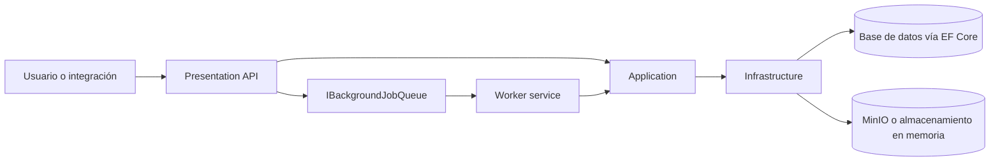
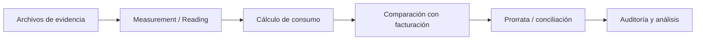
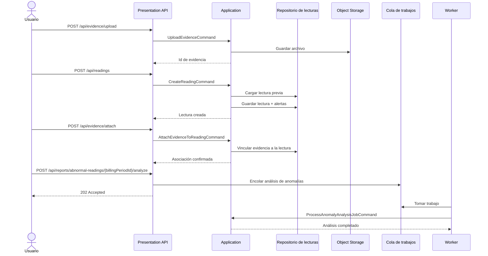
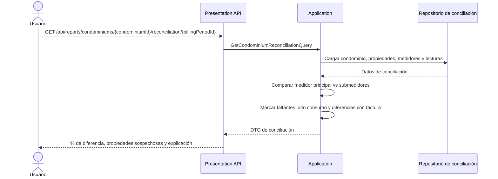
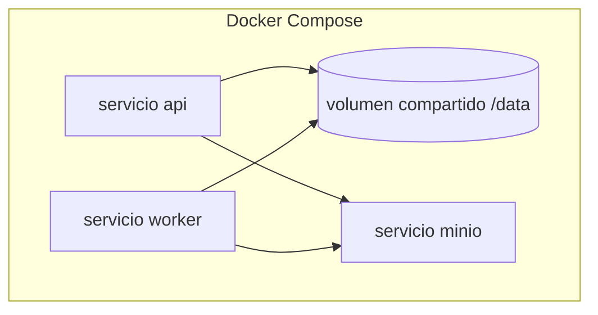

# Arquitectura de UtilityMeter

## Visión general

UtilityMeter sigue la estructura de cuatro proyectos del repositorio:

- **Presentation** recibe solicitudes HTTP y expone Swagger/OpenAPI.
- **Application** contiene la lógica de dominio, commands y queries con MediatR, validadores y mapeos a DTOs.
- **Infrastructure** implementa persistencia con SQLite/EF Core, object storage y la cola de trabajos en segundo plano.
- **Worker** consume trabajos encolados y los vuelve a despachar a handlers de Application.

## Arquitectura de alto nivel

## Flujo del dominio

## Componentes principales en ejecución

### API

La API expone endpoints agrupados para:
- lecturas
- evidencia
- reportes

Se mantiene delgada: los endpoints delegan commands y queries a `ISender`.

### Application

El proyecto Application contiene:
- readings
- evidence
- reports
- alerts
- contratos de background jobs
- abstracciones de storage

Los resultados de negocio, como alertas, se registran dentro del flujo de lectura y reportes, no como si fueran errores de formato de entrada.

### Infrastructure

Infrastructure hoy aporta:
- acceso a datos con EF Core
- persistencia configurable a base de datos mediante EF Core
- fallback de base en memoria para desarrollo cuando no hay connection string
- object storage con MinIO cuando está configurado
- despacho mediante `Channel` con persistencia de trabajos en JSON bajo `BACKGROUND_JOB_QUEUE_PATH`

### Worker

El Worker es un host separado que procesa trabajos para:
- extracción OCR
- análisis de anomalías
- generación de reportes
- exportaciones

## Secuencia: crear lectura con evidencia y procesamiento asíncrono

## Secuencia: conciliación de condominio

## Vista de despliegue local

## Notas para contribuidores

- Ejecuta **Presentation** y **Worker** si quieres probar flujos asíncronos.
- Docker Compose es la forma más simple de tener base compartida, ruta de cola y object storage en local.
- La implementación actual ya sigue la separación esperada entre escrituras rápidas por API y trabajo pesado en segundo plano.
